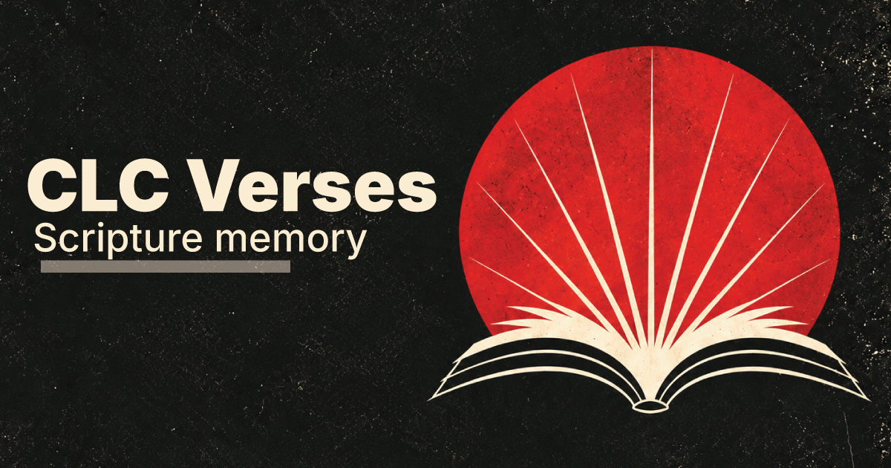

# Re-Verse

Re-Verse is a scripture memory app for Progress & Perfection. Pick a verse, and it hides the words one at a time so you can practice recalling them from memory.

**Live site:** https://re-verse-web.netlify.app/

## Who it's for

Anyone memorizing Bible verses — individually or as part of a group study.

## How to use it

1. Open the [library](https://re-verse-web.netlify.app/) and browse verses by theme.
2. Pick a verse to open its study view.
3. Tap words to reveal them as you recite the verse from memory. Keep going until you can say the whole thing without help.
